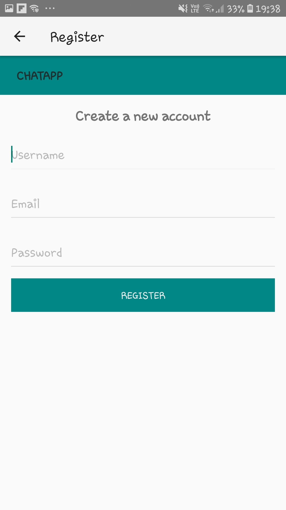

<h1 align="center">
ChatApp
</h1>
  
  

<table>
  <tr>
    <td>Android</td>
     <td>Firebase</td>
    
  </tr>
  <tr>
    <td></td>
    <td></td>
  </tr>
 </table>

  
  
  

<table>
  <tr>
    <td>Home</td>
     <td>Register</td>
     <td>Login</td>
  </tr>
  <tr>
    <td>
  
   </td>
    <td></td>
    <td></td>
  </tr>
 </table>

  

  
  

# App

